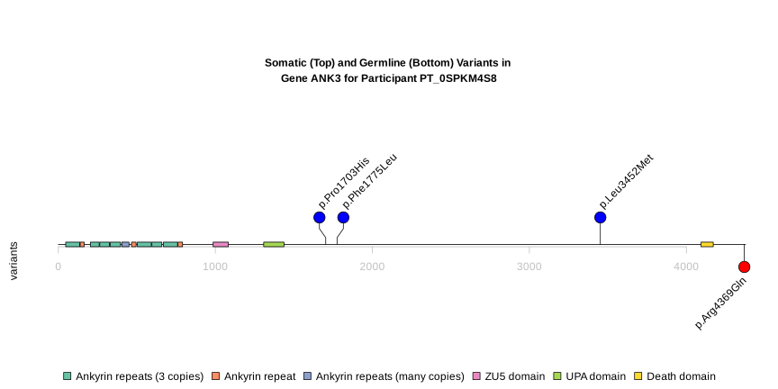
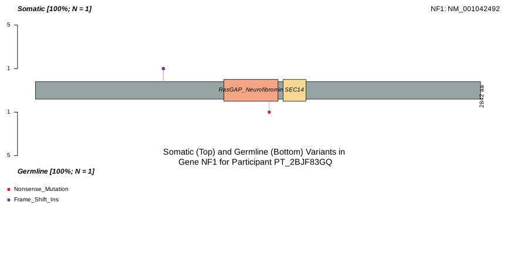

# somatic-germline-lollipop-plots-compare

This repo demonstrates two ways to visulaize somatic and germline variants for the sample participant in the same gene. We had used two R packages, `trackViewer` and `maftools`.

- example of using `trackViewer`
  
  
- example of using `maftools`
  
